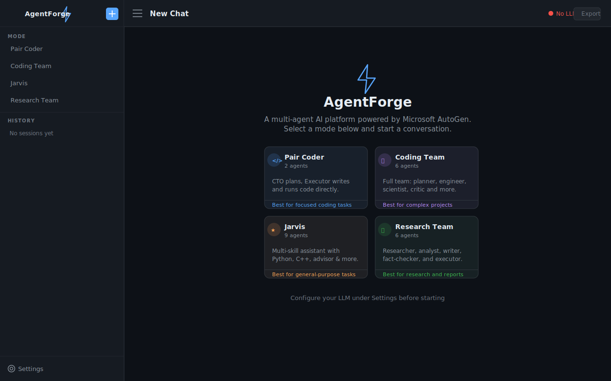
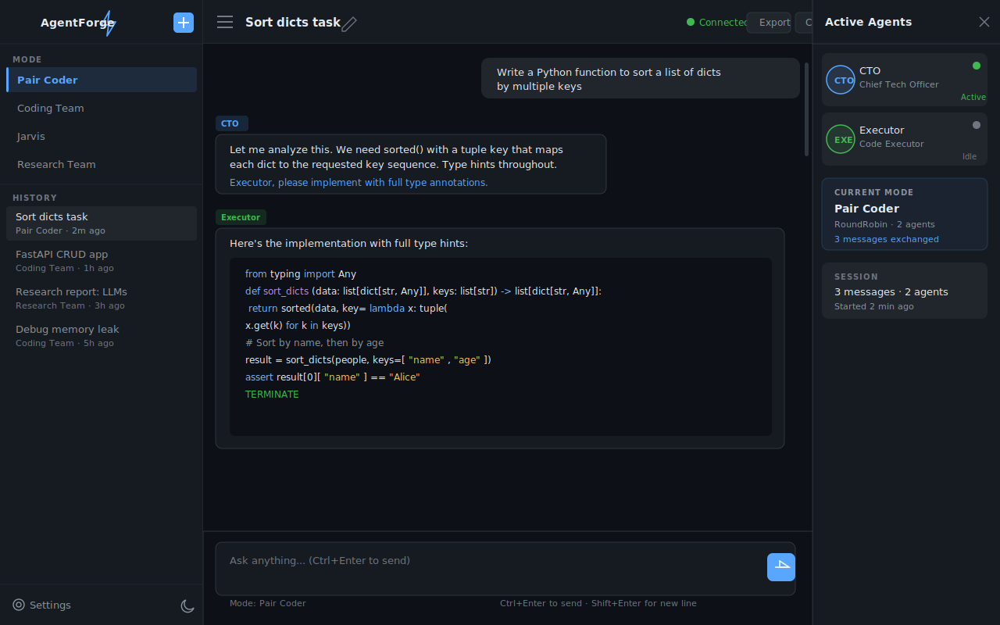

# autogen-web

A full-stack multi-agent AI platform built on [Microsoft AutoGen](https://github.com/microsoft/autogen). Orchestrate teams of specialized AI agents through a real-time web interface to solve complex coding, research, and reasoning tasks.

> Originally created to demonstrate AutoGen's multi-agent capabilities. Rebuilt as a production-grade platform with a modern UI, persistent sessions, and real-time WebSocket streaming.

---

## Screenshots





---

## What It Does

AgentForge lets you choose from four agent team configurations and direct them through a chat interface. Agents collaborate autonomously — planning, writing code, executing it, critiquing results, and iterating — while you watch the conversation unfold in real time.

```
User sends task  →  Agents plan & collaborate  →  Streamed back to UI  →  Saved to history
```

---

## Agent Modes

| Mode | Agents | Best For |
|---|---|---|
| **Pair Coder** | CTO, Executor | Focused coding tasks |
| **Coding Team** | Admin, Planner, Engineer, Scientist, Executor, Critic | Complex software and data projects |
| **Jarvis** | Jarvis, PythonCoder, CppCoder, Coder, Critic, CTO, Advisor, Friend, Aggregator | General-purpose multi-skill assistant |
| **Research Team** | Admin, Researcher, Analyst, Writer, Executor, FactChecker | Research, analysis, and report writing |

---

## Features

- Real-time agent message streaming via WebSocket
- Persistent session history in SQLite
- Per-session LLM backend configuration (local LM Studio, OpenAI, or any OpenAI-compatible API)
- Markdown and code syntax highlighting in all agent responses
- Dark and light theme
- One-click export of any conversation to Markdown
- Session rename and delete
- Live LLM connection status indicator
- Agent activity panel showing which agent is currently speaking
- REST API with interactive Swagger UI at `/api/docs`
- Single-command startup with virtual environment management
- Docker support

---

## Quick Start

**Requirements:** Python 3.10+ and a running LLM backend (e.g. [LM Studio](https://lmstudio.ai) on `localhost:1234`, or an OpenAI API key).

```bash
git clone https://github.com/punyamodi/autogen-web
cd autogen-web
cp .env.example .env
# Edit .env with your LLM details
```

**Windows:**
```bat
start.bat
```

**macOS / Linux:**
```bash
chmod +x start.sh && ./start.sh
```

**Manual:**
```bash
python -m venv .venv
source .venv/bin/activate          # Windows: .venv\Scripts\activate
pip install -r backend/requirements.txt
python -m uvicorn backend.main:app --host 0.0.0.0 --port 8000 --reload
```

Open [http://localhost:8000](http://localhost:8000).

---

## Docker

```bash
cp .env.example .env
docker-compose up --build
```

The app is available at [http://localhost:8000](http://localhost:8000). For a local LM Studio instance on the host machine, set `LLM_BASE_URL=http://host.docker.internal:1234/v1` in `.env`.

---

## Configuration

Edit `.env` (copied from `.env.example`) or update settings in the web UI under **Settings**.

| Variable | Default | Description |
|---|---|---|
| `LLM_BASE_URL` | `http://localhost:1234/v1` | OpenAI-compatible API base URL |
| `LLM_API_KEY` | `NULL` | API key (`NULL` for local models) |
| `LLM_MODEL` | `local-model` | Model identifier |
| `LLM_TEMPERATURE` | `0.1` | Sampling temperature |
| `LLM_TIMEOUT` | `600` | Per-request timeout in seconds |
| `DATABASE_URL` | `sqlite:///./agentforge.db` | SQLAlchemy database URL |
| `PORT` | `8000` | Server port |

---

## Project Structure

```
agentforge/
├── backend/
│   ├── main.py                  # FastAPI application
│   ├── requirements.txt
│   ├── agents/
│   │   ├── base.py              # Capturing agent base classes
│   │   ├── pair_coder.py        # 2-agent coding session
│   │   ├── coding_team.py       # 6-agent research and coding team
│   │   ├── jarvis.py            # 9-agent Jarvis system
│   │   └── research_team.py     # 6-agent research team
│   ├── api/
│   │   ├── chat.py              # WebSocket streaming endpoint
│   │   ├── sessions.py          # Session CRUD + export
│   │   └── config.py            # LLM config and health check
│   └── core/
│       ├── database.py          # SQLAlchemy models
│       ├── settings.py          # Pydantic settings
│       └── schemas.py           # Request/response schemas
├── frontend/
│   ├── index.html               # Single-page application
│   └── assets/
│       ├── css/styles.css
│       └── js/
│           ├── app.js           # Main state and event handling
│           ├── api.js           # REST and WebSocket clients
│           ├── chat.js          # Chat UI rendering
│           └── settings.js      # Settings modal
├── .env.example
├── Dockerfile
├── docker-compose.yml
├── start.sh
└── start.bat
```

---

## API Reference

The backend exposes a full REST API:

| Method | Path | Description |
|---|---|---|
| `WS` | `/ws/{session_id}` | Real-time agent chat |
| `GET` | `/api/sessions` | List all sessions |
| `POST` | `/api/sessions` | Create a session |
| `GET` | `/api/sessions/{id}/messages` | Get session messages |
| `GET` | `/api/sessions/{id}/export` | Export session as JSON |
| `PATCH` | `/api/sessions/{id}` | Rename or change mode |
| `DELETE` | `/api/sessions/{id}` | Delete session and messages |
| `GET` | `/api/config/modes` | List available agent modes |
| `GET` | `/api/config/llm` | Get current LLM config |
| `GET` | `/api/config/health` | Health check with LLM reachability |

Interactive Swagger UI: [http://localhost:8000/api/docs](http://localhost:8000/api/docs)

---

## Tech Stack

**Backend:** FastAPI · PyAutoGen · SQLAlchemy · SQLite · WebSockets · Uvicorn

**Frontend:** Vanilla HTML/CSS/JS · Marked.js · Highlight.js · Google Fonts

**Infrastructure:** Docker · python-dotenv · Pydantic

---

## Legacy Code

The original AutoGen scripts are preserved in the [`legacy/original`](https://github.com/punyamodi/autogen-web/tree/legacy/original) branch.

---

## License

MIT
